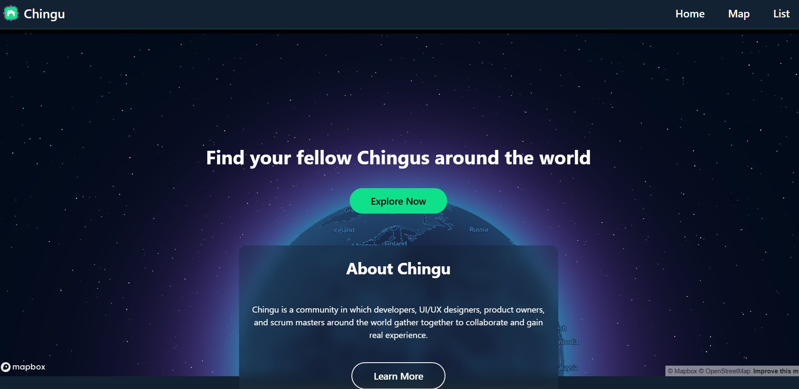
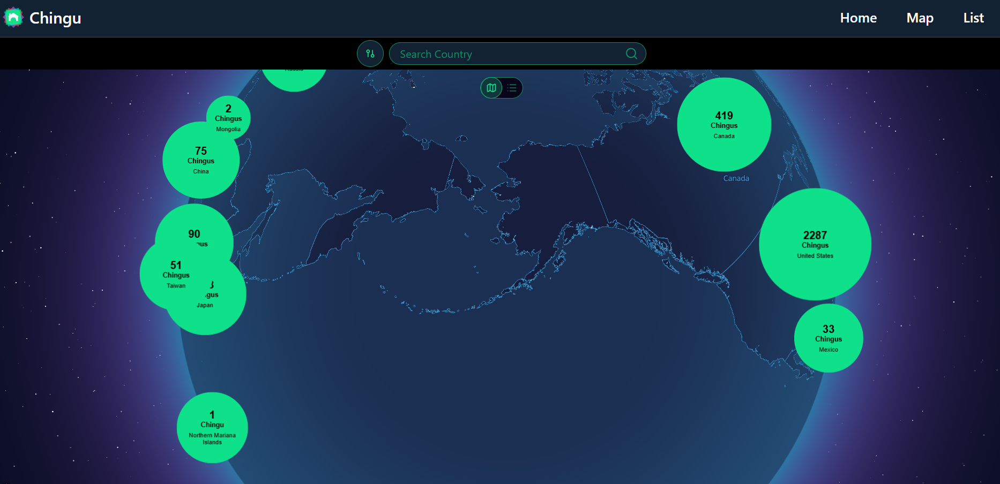
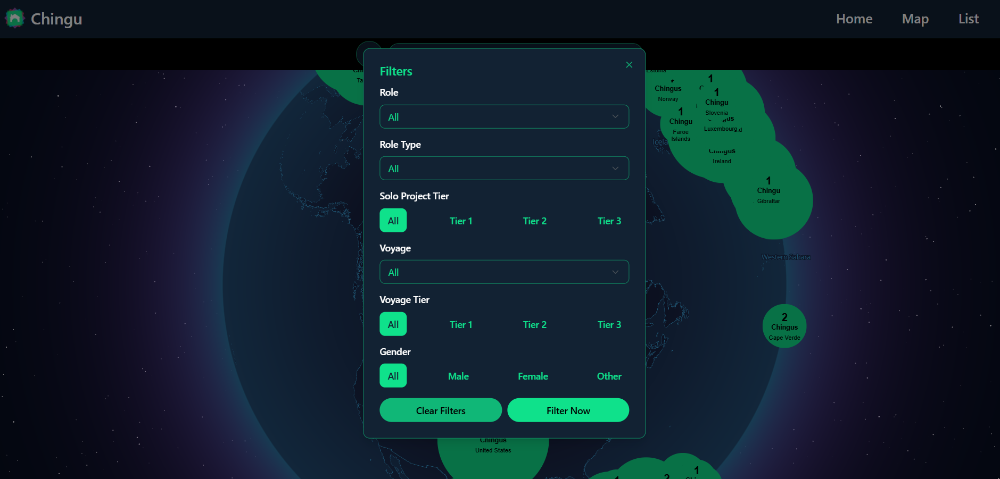
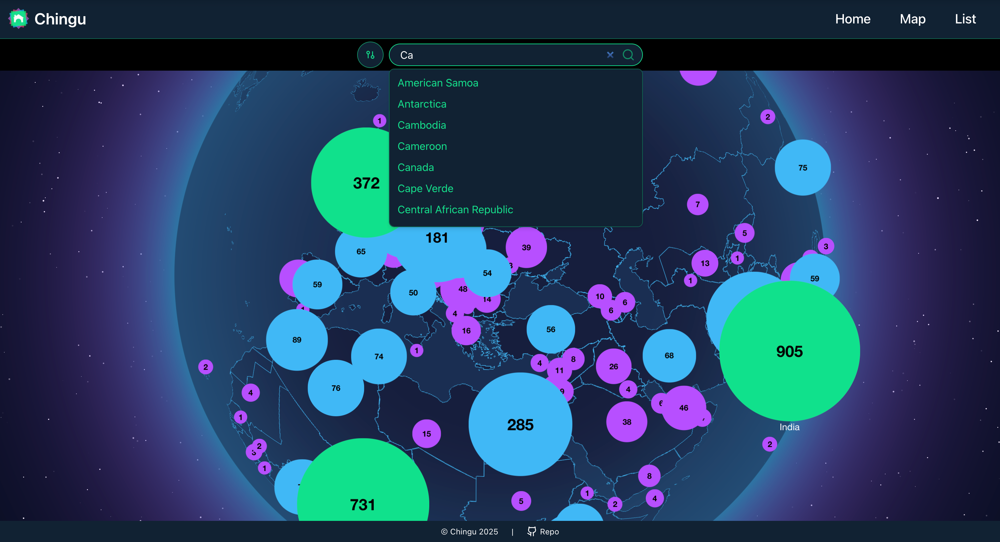
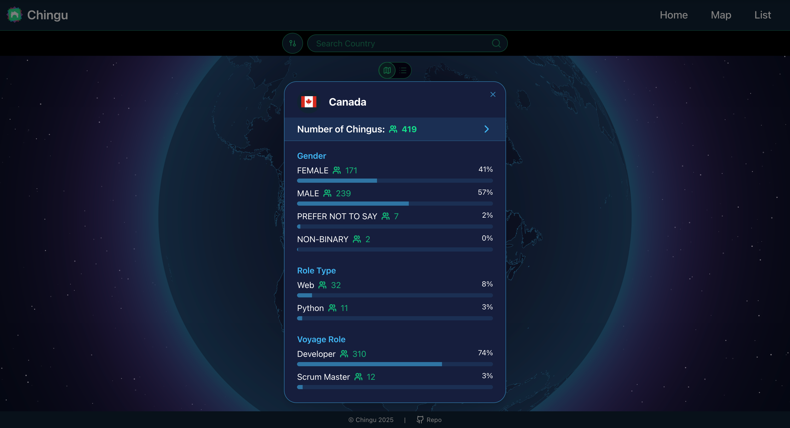
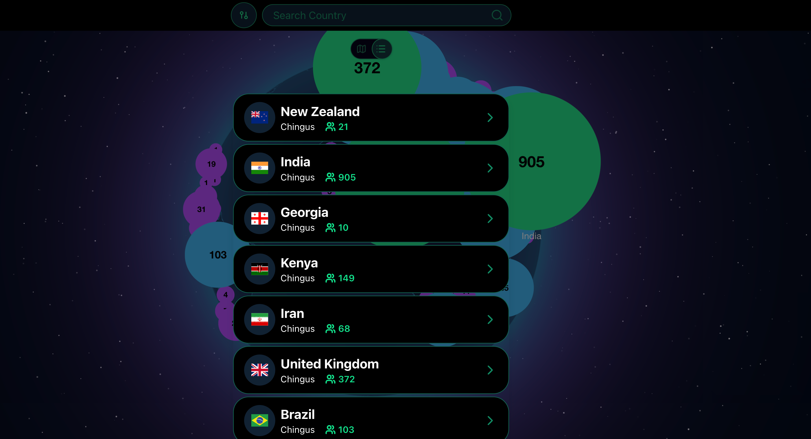

# 🌍 We-Connect

## Overview
We-Connect is a data visualization platform built as part of a **Chingu Voyage**.  
The goal of this project is to explore and understand Chingu’s global community by visualizing data from **thousands of users** across the world.



By combining interactive maps, filters, and animated transitions, We-Connect makes it easy to analyze user distribution by country, role, project tier, and gender.

## Features
- 🌎 **Global Map Visualization**
  
  - Interactive Mapbox globe displaying users by country
  - Animated zoom and focus when a country is selected

- 🔍 **Advanced Filtering**
  
  - Filter users by:
    - Solo Project Tier (Tier 1–3)
    - User Tier (Tier 1–3)
    - Role (Scrum Master, Developer, UI/UX Designer, etc.)
    - Gender
  - Apply **multiple filters simultaneously**
  - Remove filter layers individually to reveal more data

- 📍 **Country Search**
  
  - Search for a country directly
  - Triggers map animation and displays a detailed info card

- 🪪 **Dynamic Info Cards**
  
  - Pop-up cards show filtered user insights
  - Automatically update based on active filters

- 🔁 **Map & List View Toggle**
  
  - Switch between:
    - Interactive map view
    - Structured list view for easier data scanning

## Tech Stack
- **Framework:** Next.js
- **Language:** TypeScript
- **UI:** React
- **State Management:** Zustand
- **Styling:** Tailwind CSS + Custom CSS (preset color system)
- **Icons:** Lucide Icons
- **Database:** Prisma
- **Mapping & Visualization:** Mapbox

## Running the Project Locally

1. Clone the repository:
   ```bash
   git clone https://github.com/chingu-voyages/V58-tier3-team-30/tree/main/chingu-map-app.git

2. Install dependencies:
   ```bash
   npm install

3. Set up environment variables:
   ```bash
   NEXT_PUBLIC_MAPBOX_TOKEN=your_mapbox_token
   DATABASE_URl=your_supabase_pooling_url
   DIRECT_URL=your_direct_url_to_database
   
4. Set up the database with Prisma:
   ```bash
   npx prisma generate
   npx prisma migrate dev

5. Start the development server:
   ```bash
   npm run dev

6. Open your browser:
   ```bash
   http://localhost:3000


## Our Team

- Adelola Abioye: [GitHub](https://github.com/Adel-abio) / [LinkedIn](https://www.linkedin.com/in/adelola-abioye/)
- Andrew Smith: [GitHub](https://github.com/meuzishun) / [LinkedIn](https://www.linkedin.com/in/andrew-sm1th/)
- Gursimran [GitHub](https://github.com/Gursimranb127) / [LinkedIn](https://www.linkedin.com/in/gursimransinghonly)
- Margaret Wu [GitHub](https://github.com/margaretcwu) / [LinkedIn](https://www.linkedin.com/in/margaretcwu/)
- Sabrina Shuss [GitHub](https://github.com/sabrinadshuss) / [LinkedIn](https://www.linkedin.com/in/sabrinashuss/)
- Yuhang Zhou: [GitHub](https://github.com/zhou0244) / [LinkedIn](https://www.linkedin.com/in/yuhang-zhou-170b21148/)
